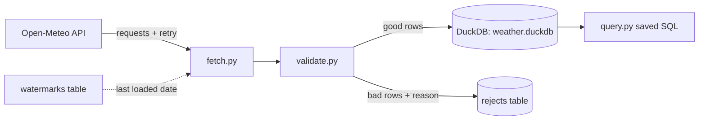

# Pipeline Zero — Spec

## Elevator pitch

A production-shaped command-line ingestion pipeline: it pulls historical weather for configurable cities from the Open-Meteo API into DuckDB — incrementally, idempotently, with retries, validation, and tests. Small enough to finish in ~1.5 weeks; shaped like the real thing in every way that matters.

## Skills demonstrated

- Python project structure with uv, argparse CLI, pytest (modules 1.1–1.2, 1.6)
- HTTP ingestion: pagination-by-date, timeouts, retry with exponential backoff (module 1.3)
- SQL + DuckDB: explicit schemas, upserts, analytical queries (modules 1.4–1.5)
- The core pipeline properties: **idempotency**, **incremental loading via watermarks**, **validation with a reject lane**

## Requirements

### Functional

1. FR-1 `ingest --city <name>` fetches hourly weather from Open-Meteo's archive API for that city from the last loaded date (watermark) through yesterday, and loads it into DuckDB.
2. FR-2 `ingest` with no prior state performs the initial load from a configured `start_date`.
3. FR-3 `backfill --city <name> --start <d> --end <d>` reloads an explicit date range (idempotently — no duplicates after any number of runs).
4. FR-4 Rows failing validation (nulls in required fields, temperatures outside −60..60 °C, duplicate timestamps) go to a `rejects` table with a reason — never silently dropped, never crashing the run.
5. FR-5 `query --name <saved-query>` runs a saved analytical SQL (at least: daily summary per city, hottest/coldest days, 7-day rolling average) and prints a readable table.
6. FR-6 `status` prints per-city watermarks, row counts, and reject counts.
7. FR-7 Cities are configured in a checked-in `config.toml` (name, latitude, longitude) — adding a city requires no code change.

### Non-functional

- NFR-1 **Idempotency**: any command re-run produces identical end state (verified by a test and by checkpoint M3).
- NFR-2 Transient HTTP failures (429, 5xx, timeouts) retried with exponential backoff + jitter; permanent failures (4xx) fail fast with a clear message.
- NFR-3 pytest suite covers transform, validation, and watermark logic without hitting the network (fake responses).
- NFR-4 Structured logging (level, city, date range, rows in/loaded/rejected) — no bare `print` in library code.
- NFR-5 A stranger can run it with 3 commands (see Definition of done).

## Architecture

| Component | Role | Why this tool (trade-off note) |
|---|---|---|
| Open-Meteo archive API | Source | Keyless and free — no signup friction; date-ranged endpoints teach incremental loading naturally. Alternative (GitHub API) needs tokens and teaches pagination-by-cursor instead — noted for a stretch goal. |
| requests | HTTP | The boring standard. httpx adds async we don't need yet. |
| DuckDB | Storage | In-process analytical SQL — zero servers, and it's the engine the whole curriculum leans on. SQLite would work but is row-oriented; Postgres needs a server — both covered in the P1 ADR you'll write. |
| argparse | CLI | Stdlib, zero deps. click/typer are nicer but hide what a CLI actually is — learn the primitive first. |
| pytest | Tests | The Python standard. |

## Data

- Source: `https://archive-api.open-meteo.com/v1/archive` (hourly `temperature_2m`, `precipitation`, `wind_speed_10m`).
- Size: ~24 rows/city/day — tiny on purpose; the patterns, not the volume, are the point.
- Local DB: `data/weather.duckdb` (the `data/` folder is gitignored — repo rule).
- Tables: `raw_weather(city, ts, temperature_c, precipitation_mm, wind_kmh, loaded_at)` with PRIMARY KEY `(city, ts)`; `watermarks(city, last_date)`; `rejects(city, ts, payload, reason, rejected_at)`.

## Milestones

| M# | Deliverable | Definition of done |
|---|---|---|
| M0 | Running skeleton | `uv run pipeline-zero --help` shows subcommands; 1 placeholder test passes |
| M1 | Fetch | `fetch` pulls one city + date range, prints row count; timeouts handled |
| M2 | Load | Rows land in DuckDB with explicit schema; **re-running does not duplicate** |
| M3 | Incremental | Watermarks advance; `backfill` reloads ranges idempotently |
| M4 | Robustness | Retry/backoff proven against a fake flaky server; validation + rejects lane; structured logs |
| M5 | Polish | Saved queries, `status`, README with diagram, ADR-001, resume bullets |

## Definition of done

- [ ] All milestones complete; `uv run pytest` green
- [ ] A stranger can run it with 3 commands: `uv sync` → `uv run pipeline-zero ingest --city london` → `uv run pipeline-zero query --name daily-summary`
- [ ] Running any command twice in a row changes nothing the second time (prove it with `status` before/after)
- [ ] README with the architecture diagram and honest "what I'd do differently"
- [ ] ADR-001 written: *Why DuckDB (vs SQLite vs Postgres) for this project*
- [ ] Resume bullets refined with real numbers

## Stretch goals

- Second source with cursor pagination (GitHub events API) — teaches token auth + cursor vs date pagination
- `--parallel` city ingestion with `concurrent.futures` — teaches I/O-bound concurrency
- Export daily summaries to Parquet — first contact with the format Phase 2 dissects

## Resume bullets (draft — quantify at the end)

- Built a tested, idempotent ingestion CLI (Python, DuckDB) loading N years × M cities of hourly weather with incremental watermarks, retry/backoff, and a validation reject lane.
- Designed rerun-safe loading (primary-key upsert + per-city watermarks) verified by an idempotency test suite.

## Interview Q&A prep (answer these yourself at the end)

1. Walk me through what happens when `ingest` runs twice concurrently. What breaks, and how would you fix it?
2. Why a watermark per city instead of one global watermark?
3. Your API starts returning duplicate timestamps within one response — where does your pipeline catch that, and where *should* it?
4. When would this design stop working? (Data volume, API limits, schema drift — pick one and go deep.)
