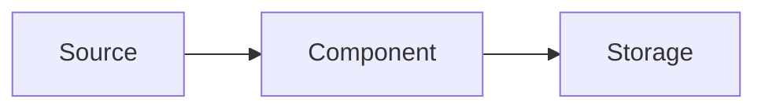

# {Project Name} — Spec

## Elevator pitch

Two sentences you could say in an interview. What it is, what it proves you can do.

## Skills demonstrated

Bulleted, mapped to the phase's modules.

## Requirements

### Functional (numbered, testable)

1. FR-1 …
2. FR-2 …

### Non-functional

- NFR-1 Idempotency: re-running produces no duplicates.
- NFR-2 Test coverage on core logic.
- NFR-3 A stranger can run this with 3 commands.

## Architecture

| Component | Role | Why this tool (trade-off note) |
|---|---|---|

## Data

Source, size, schema, and the download/generation script location. **Data is never committed.**

## Milestones

| M# | Deliverable | Definition of done |
|---|---|---|
| M0 | Repo scaffold + running skeleton | … |
| M{n} | Polish: README, diagram, resume bullets | … |

M0 is always a running skeleton; the last milestone is always polish.

## Definition of done (project level)

- [ ] All milestones complete
- [ ] Tests pass
- [ ] A stranger can run this with 3 commands (verified)
- [ ] README with architecture diagram
- [ ] Resume bullets refined
- [ ] ADRs written for the significant decisions

## Stretch goals

Optional extensions, each with what it would teach.

## Resume bullets (draft)

2–3 quantified bullets; refine at the end with real numbers.

## Interview Q&A prep

Questions this project invites. The user writes answers at the end of the build.
